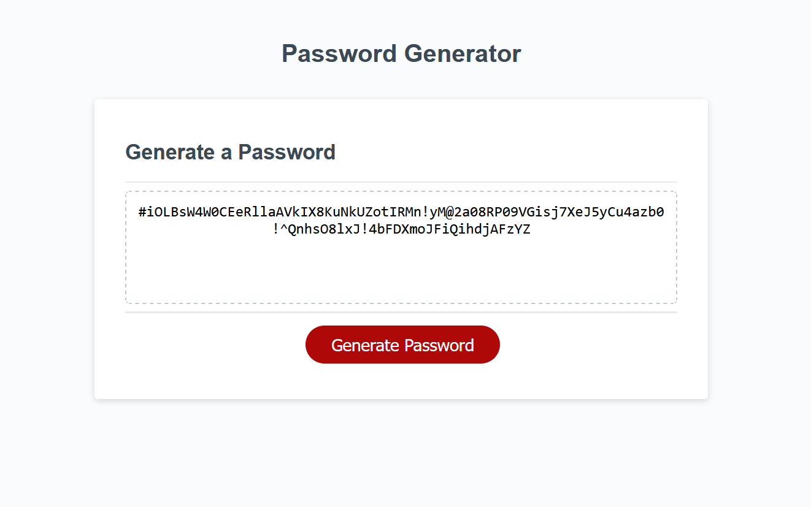

# Password-Generator

## Description

Added JavaScript to code which prompts user to provide criteria for password to be generated including its minumum length, maximum length, and an alert informing the user of allowed character types. Also added code necessary to randomly generate a password which met this criteria as input by the user. 

## Preview

## Installation

N/A

## License

None

## Deployed Page Link

https://cmurphgarv.github.io/Password-Generator/

